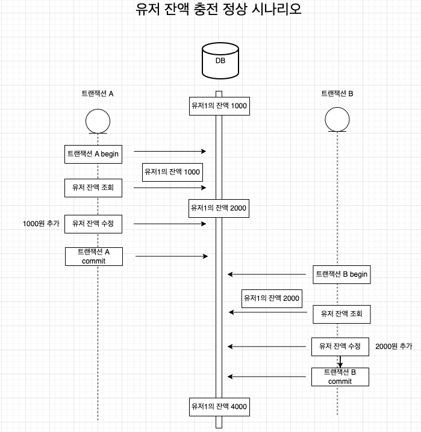
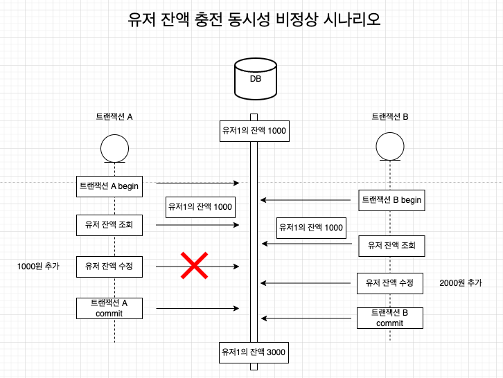
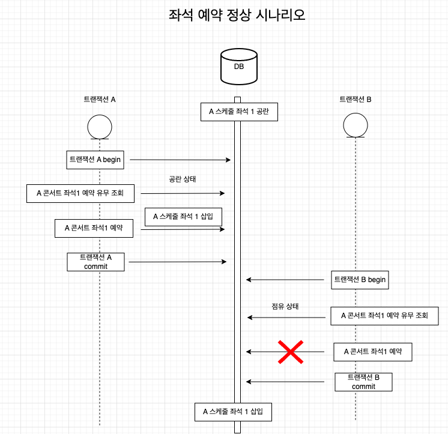
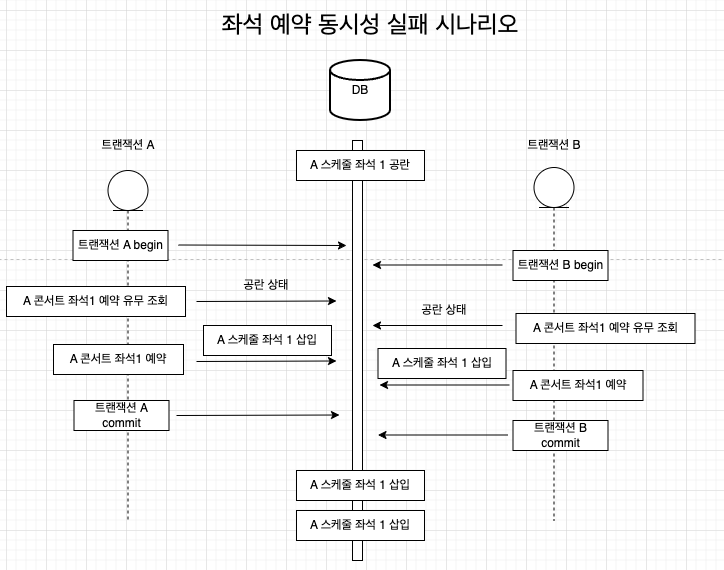

## 동시성 시나리오 분석

### 유저 잔액 충전

#### 정상 시나리오
  

####  동시성으로 인한 문제 발생 시나리오


#### 비즈니스 로직 순서

```text
tx {
  - 유저 조회
  - 잔액 업데이트
}
```

- 전체 비즈니스 로직을 트랜잭션으로 묶는다.
    - 조회 후 갱신이기 때문에 동시성 문제가 발생할 수 있다.
    - 동시성 문제가 발생하면 잔액 충전의 요청이 정합성이 깨질 수 있다.

#### 락 적용
- 비관적 락 적용

#### 낙관적 락 선택 이유
- 유저의 잔액 충전은 본인만 가능하다. 그렇기 때문에 동시성으로 인한 문제가 발생할 가능성은 낮다.
- 유저의 잔액 충전은 공정성이 필요하지 않기 때문에 낙관적 락 적용시 문제 없다.
- 잔액 충전에 락을 적용하는 이유는 따닥을 막기 위함이다.
  - 잔액 충전을 한번만 성공시켜야 한다. 
- 비즈니스 흐름과 로직의 복잡도가 간단하기 때문에 비관적 락을 선택해도 문제는 없지만 커넥션 낭비를 조금이라도 줄이기 위해 낙관적 락을 선택 했다. 

#### 낙관적 락 주의 사항
- 요청이 많은데 리트라이 재시도 횟수가 적을 경우 데이터 정합성이 깨질 수 있다.
    - 지정한 횟수 까지 재시도를 했어도 마지막 까지 실패한 요청같은 경우는 업데이트가 반영이 되지 않기 때문이다.
    - 테스트를 해보면서 적절한 리트라이 횟수를 찾아야 한다.
- 재시도 횟수가 많을 수록 디비 부하가 걸리기 때문에 해당 메서드 자체의 실행 속도는 비관적 락 보다 오히려 증가할 수 있다. 

#### 비관적 락과 낙관적 락 실행 속도 비교
- 스레드 수를 점진적으로 늘려 가면서 테스트 코드 실행 시간 비교

| 스레드 수            | 낙관적 락  | 비관적 락 |
|------------------|--------|-------|
| 스레드 10개시 수행 속도   | 0.7s   | 0.8s  |
| 스레드 100개시 수행 속도  | 1.2s   | 0.6s  |
| 스레드 1000개시 수행 속도 | 7.251s | 2.4s  |
- 낙관적 락의 경우 스레드 요청수를 증가시킬 수록 적절한 재시도 횟수를 찾아야 데이터 정합성을 유지할 수 있다.
- 스레드 요청이 많을 경우 낙관적 락의 수행 속도가 더 오래 걸리는 결과가 나왔다.

### 좌석 예약

#### 정상 시나리오


#### 동시성으로 인한 문제 발생 시나리오


#### 비즈니스 로직 순서
```text      
  - 콘서트 스케줄 조회
  tx {      
  - 예약 정보 조회     (select) 
  - 이미 예약된 좌석인지 검증 (validate)
  - 예약 성공 혹은 실패      
    - 이미 예약되었을 경우 좌석 예약 실패 
    - 예약 되지 않았을 경우 좌석 예약 성공 (insert)  
  }      
```
- 예약 정보를 조회하는 시점 부터 트랜잭션으로 묶는다.    
  - 로직 패턴이 조회 후 삽입이기 때문에 동시성 문제가 발생할 수 있다.    
  - 동시성 문제가 발생하면 예약 테이블에 데이터가 2건이상 들어갈 수 있다.    
    
#### 락 적용  
- 비관적 락 적용    
    
#### 비관적 락 선택 이유  
- 비즈니스 로직 상 update 로직이 없기 때문에 낙관적 락은 적용할 수 없다.
- 같은 스케줄의 같은 좌석을 2건 이상 선점 하는 것을 막아야 하기 때문에 비관적 락을 적용
  - 요청을 순차적으로 처리하여 먼저 들어온 요청이 좌석을 선점하고 나머지 요청은 순차적으로 들어오되 검증에서 실패하게 된다.
- 비즈니스만 보았을 때는 한명만 좌석을 선점할 수 있기 때문에 나머지 요청은 실패를 시키는 낙관적 락이 어울리지만, 비즈니스 로직 흐름상 update 로직이 없기 때문에 비관적 락을 적용
