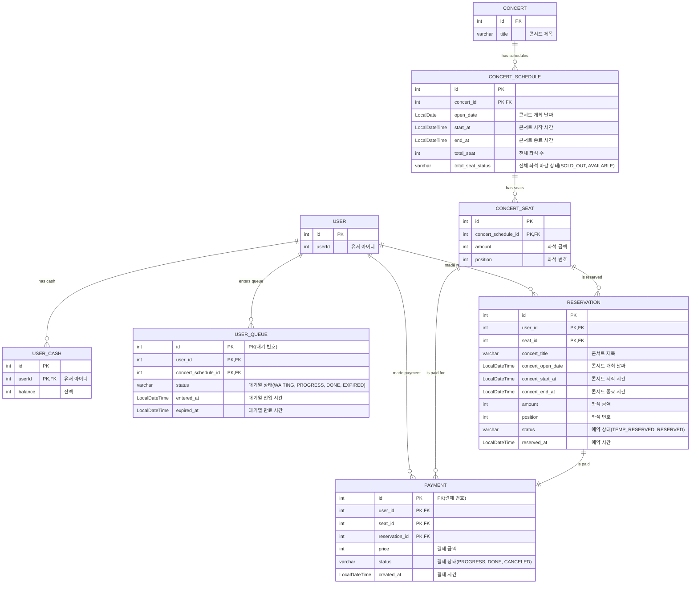

**[ ERD ]**

```mermaid
erDiagram
    USER_CASH {
        int id PK
        int userId PK,FK "유저 아이디"
        int balance "잔액"
    }

    USER {
        int id PK
        int userId "유저 아이디"
    }

    USER_QUEUE {
        int id PK "PK(대기 번호)"
        int user_id PK, FK
        int concert_schedule_id PK, FK
        varchar status "대기열 상태(WAITING, PROGRESS, DONE, EXPIRED)"
        LocalDateTime entered_at "대기열 진입 시간"
        LocalDateTime expired_at "대기열 만료 시간"
    }

    PAYMENT {
        int id PK "PK(결제 번호)"
        int user_id PK, FK
        int seat_id PK, FK
        int reservation_id PK, FK
        int price "결제 금액"
        varchar status "결제 상태(PROGRESS, DONE, CANCELED)"
        LocalDateTime created_at "결제 시간"
    }

    CONCERT {
        int id PK
        varchar title "콘서트 제목"
    }

    CONCERT_SCHEDULE {
        int id PK
        int concert_id PK, FK
        LocalDate open_date "콘서트 개최 날짜"
        LocalDateTime start_at "콘서트 시작 시간"
        LocalDateTime end_at "콘서트 종료 시간"
        int total_seat "전체 좌석 수"
        varchar total_seat_status "전체 좌석 마감 상태(SOLD_OUT, AVAILABLE)"
    }

    CONCERT_SEAT {
        int id PK
        int concert_schedule_id PK, FK
        int amount "좌석 금액"
        int position "좌석 번호"
    }

    RESERVATION {
        int id PK
        int user_id PK, FK
        int seat_id PK, FK
        varchar concert_title "콘서트 제목"
        LocalDateTime concert_open_date "콘서트 개최 날짜"
        LocalDateTime concert_start_at "콘서트 시작 시간"
        LocalDateTime concert_end_at "콘서트 종료 시간"
        int amount "좌석 금액"
        int position "좌석 번호"
        varchar status "예약 상태(TEMP_RESERVED, RESERVED)"
        LocalDateTime reserved_at "예약 시간"
    }

    CONCERT ||--o{ CONCERT_SCHEDULE: "has schedules"
    CONCERT_SCHEDULE ||--o{ CONCERT_SEAT: "has seats"
    USER ||--o{ USER_QUEUE: "enters queue"
    USER ||--o{ USER_CASH: "has cash"
    USER ||--o{ PAYMENT: "made payment"
    CONCERT_SEAT ||--o{ PAYMENT: "is paid for"
    USER ||--o{ RESERVATION: "made reservation"
    CONCERT_SEAT ||--o{ RESERVATION: "is reserved"
    RESERVATION ||--|| PAYMENT: "is paid"
```
