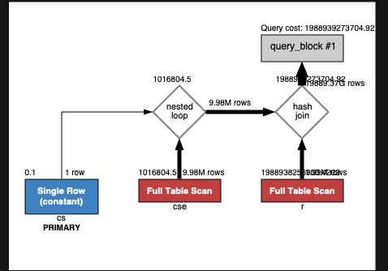
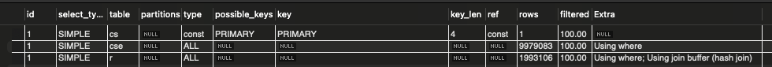
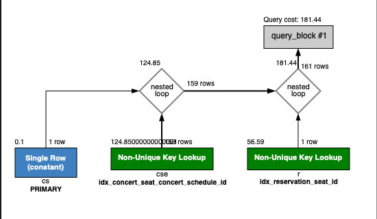
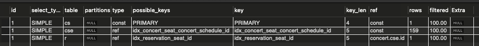

## 인덱스 보고서

## 테이블 데이터 건수
```sql
select count(*) from concert;
- 20만건

select count(*) from concert_schedule;
- 20만건

select count(*) from concert_seat;
- 1000만건
  - 한 스케줄당 좌석 50개
    - 20만건 * 50개

select count(*) from reservation;
- 200만건

select count(*) from payment;
- 200만건
```

- 콘서트 스케줄의 좌석 정보를 조회하는 쿼리
```sql
SELECT
  cs.id AS seat_id,
  cs.total_seat AS total_seat,
  cse.position AS position,
    cse.amount AS amount,
    r.status AS reservation_status
FROM concert_schedule cs
  LEFT JOIN concert_seat cse ON cs.id = cse.concert_schedule_id
  LEFT JOIN reservation r ON cse.id = r.seat_id
WHERE
  cs.id = 1;
```

### 인덱스 생성 전  

- concert_seat와 reservation 테이블의 풀 스캔이 발생


- type이 ALL이고 rows가 테이블의 모든 데이터 개수와 일치하다.
  - 테이븗 풀 스캔 했다는 증거

explain analyze 결과
```sql
-> Left hash join (r.seat_id = cse.id)  (cost=1988938256900.57 rows=19889370201798) (actual time=4488.255..25384.507 rows=50 loops=1)
    -> Nested loop left join  (cost=1018787.49 rows=9979083) (actual time=1.166..19853.174 rows=50 loops=1)
        -> Rows fetched before execution  (cost=0.00 rows=1) (actual time=0.002..0.002 rows=1 loops=1)
        -> Filter: (cse.concert_schedule_id = 1)  (cost=1018787.49 rows=9979083) (actual time=1.103..19853.069 rows=50 loops=1)
            -> Table scan on cse  (cost=1018787.49 rows=9979083) (actual time=1.089..16274.997 rows=10000000 loops=1)
    -> Hash
        -> Table scan on r  (cost=0.14 rows=1993106) (actual time=0.882..2927.358 rows=2000000 loops=1)
```
- 가장 바깥쪽 단계의 Left hash join의 actual time의 오른쪽 시간이 종료 시간 쿼리의 종료 시간
  - 평균 25초 소요

인덱스 생성
```sql
CREATE INDEX idx_concert_seat_concert_schedule_id ON concert_seat(concert_schedule_id);
```
- 기존 테이블의 데이터가 많아서 신규 테이블 생성 후 인덱스 추가 한다음 데이터 재 삽입

```sql
CREATE INDEX idx_reservation_seat_id ON reservation(seat_id);
```
- 기존 테이블의 데이터가 많아서 신규 테이블 생성 후 인덱스 추가 한다음 데이터 재 삽입

### 인덱스 생성 후  

- concert_seat와 reservation 테이블의 풀스캔이 사라지고 인덱스를 사용


- key에 생성한 인덱스가 사용
- type이 ref고 rows가 확연히 줄어들었다

explain analyze 결과
```sql
-> Nested loop left join  (cost=211.08 rows=109) (actual time=2.988..4.838 rows=50 loops=1)
    -> Nested loop left join  (cost=91.50 rows=100) (actual time=2.859..3.071 rows=50 loops=1)
        -> Rows fetched before execution  (cost=0.00 rows=1) (actual time=0.003..0.003 rows=1 loops=1)
        -> Index lookup on cse using idx_concert_seat_concert_schedule_id (concert_schedule_id=1)  (cost=91.50 rows=100) (actual time=2.842..2.972 rows=50 loops=1)
    -> Index lookup on r using idx_reservation_seat_id (seat_id=cse.id)  (cost=1.09 rows=1) (actual time=0.031..0.031 rows=0 loops=50)

```
- 가장 바깥쪽 단계의 Left hash join의 actual time의 오른쪽 시간이 종료 시간 쿼리의 종료 시간
  - 평균 5초 소요

### 결론
- join에 사용되는 key에 인덱스를 추가하였더니 성능이 증가하였다. 
  - 인덱스가 있으면 조인할떄 조인에 필요한 데이터를 빠르게 찾을 수 있다.
  - 인덱스가 없으면 테이블을 풀 스캔하여 데이터를 찾아야 하기 때문에 성능이 떨어진다.
- 외래키를 추가하면 인덱스까지 생성된다. 하지만 외래키를 추가하지 않는다면 인덱스를 직접 생성하는 것을 놓치지 말자.
